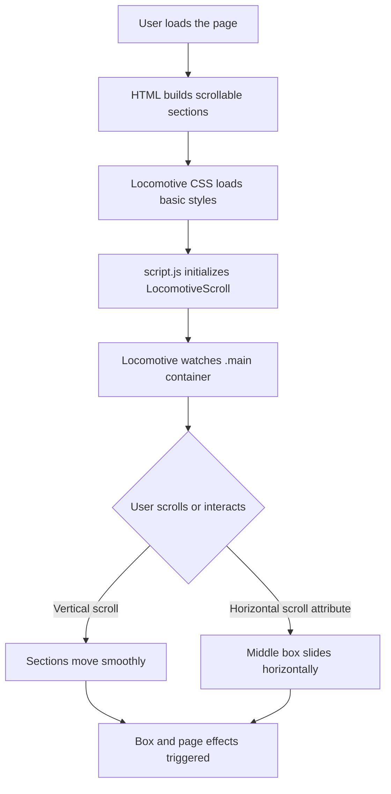

# Locomotive Scroll Simple Demo 🚄

This project is a quick demo showing how to use [Locomotive Scroll](https://locomotivemtl.github.io/locomotive-scroll/) — a modern smooth-scrolling library for web projects. Here’s how I set up a basic vertical and horizontal scroll effect using Locomotive’s features, with a dark, modern style!

---

## What’s in This Demo? 🔎

- **index.html**: Builds the page structure and imports Locomotive resources.
- **style.css**: Customizes the look with a sleek, dark theme.
- **script.js**: Initializes Locomotive Scroll for smooth, snappy scrolling.

---

## index.html

This is the main HTML page. It sets up the scrollable sections and boxes, loads fonts and Locomotive’s CSS/JS, and links to my custom styles and scripts.

```html
<!DOCTYPE html>
<html lang="en">
<head>
  <meta charset="UTF-8">
  <meta name="viewport" content="width=device-width, initial-scale=1.0">
  <!-- Google Fonts and Locomotive CSS -->
  <link rel="preconnect" href="https://fonts.googleapis.com">
  <link rel="preconnect" href="https://fonts.gstatic.com" crossorigin>
  <link href="https://fonts.googleapis.com/css2?family=Poppins:wght@100;200;300;400;500;600;700;800;900&display=swap" rel="stylesheet">
  <link rel="stylesheet" href="https://cdn.jsdelivr.net/npm/locomotive-scroll@3.5.4/dist/locomotive-scroll.css">
  <link rel="stylesheet" href="style.css">
  <title>Document</title>
</head>
<body>
  <div class="main" data-scroll-container>
    <div id="page1" data-scroll-section></div>
    <div id="page2" data-scroll-section>
      <div id="box" data-scroll></div>
      <div id="box" data-scroll data-scroll-direction='horizontal' data-scroll-speed="-1"></div>
      <div id="box" data-scroll></div>
    </div>
    <div id="page3" data-scroll-section></div>
  </div>
  <script src="https://cdn.jsdelivr.net/npm/locomotive-scroll@3.5.4/dist/locomotive-scroll.js"></script>
  <script src="script.js"></script>
</body>
</html>
```

### How I Built It

- **Scroll Container**: `<div class="main" data-scroll-container>` is the root scroll area for Locomotive.
- **Sections**: Each `div` with `data-scroll-section` is a scrollable page or region.
- **Boxes**: Inside `#page2`, three `#box` elements are scrollable blocks. The middle one scrolls horizontally at a different speed!
- **Fonts & Styles**: Uses the Poppins font and imports Locomotive’s CSS for base styles.
- **CDN**: Loads Locomotive’s library directly from CDN.
- **Custom Code**: Links to my own `style.css` and `script.js`.

---

## style.css

This file sets the dark, modern visual style for the whole page and scrollable elements.

```css
* { 
  margin: 0; 
  padding: 0; 
  box-sizing: border-box; 
  font-family: 'Poppins'; 
}
body { 
  width: 100%; 
  height: 100vh; 
  background-color: #000; 
  color: white; 
}
#page1 { 
  height: 100vh; 
  width: 100%; 
  background-color: rgb(15, 15, 15); 
}
#page2 { 
  height: 100vh; 
  width: 100%; 
  background-color: rgb(37,37,37); 
  display: flex; 
  align-items: center; 
  justify-content: center; 
  gap:5rem; 
}
#page3 { 
  height: 100vh; 
  width: 100%; 
  background-color: rgb(15, 15, 15); 
}
#box { 
  height: 300px; 
  width: 300px; 
  background-color: rgb(65, 193, 225); 
  border-radius: 10px; 
}
```

### What I Did Here

- **Universal Reset**: Removes default margins/paddings, sets `Poppins` for all text.
- **Full-Screen Layout**: Each page (`#page1`, `#page2`, `#page3`) fills the entire viewport (`100vh` height).
- **Dark Theme**: Uses deep greys and black for a modern look, with high-contrast cyan boxes.
- **Centering**: `#page2` uses flexbox to center the boxes and space them apart.
- **Styled Boxes**: Each `#box` is a 300x300px, rounded, colored block.

---

## script.js

This script boots up Locomotive Scroll, making the scroll smooth and applying effects to elements with data-scroll attributes.

```js
const scroll = new LocomotiveScroll({
  el: document.querySelector('.main'),
  smooth: true,
  lerp: 0.009
});
```

### What’s Happening?

- **Initialization**: Locomotive Scroll targets `.main` as the scrollable area.
- **Smooth Scrolling**: The `smooth: true` option turns on inertia and smooth transitions.
- **Lerp Setting**: `lerp: 0.009` controls how “laggy” or fluid the scroll feels (lower = smoother but more delayed).
- **Automatic Effects**: All elements with `data-scroll` or `data-scroll-*` attributes animate according to their settings.

---

## How Does Locomotive Scroll Work Here? 🛤️

Here’s a quick flow of how the files connect and how Locomotive Scroll brings the smooth scroll experience:



---

## Locomotive Scroll Features in This Demo ⚙️

- **Vertical & horizontal scrolling**: The second box moves horizontally as you scroll vertically thanks to `data-scroll-direction="horizontal"`.
- **Scroll speeds**: The middle box also has `data-scroll-speed="-1"` which animates it faster and in the inverse direction of scroll.
- **Sections**: Breaking the page into clear, full-viewport scrollable sections.

---

## How I Used Locomotive Scroll

1. **HTML**: Marked the main scrollable area with `data-scroll-container`.
2. **Sections**: Used `data-scroll-section` on each page for modular scroll control.
3. **Scroll Effects**: Applied `data-scroll`, and for advanced movement, added `data-scroll-direction` and `data-scroll-speed`.
4. **JS Initialization**: Just a few lines in `script.js` to enable smooth, inertial scrolling.
5. **Styling**: Made sure the scrolling elements stand out and the layout is full-viewport.

---

## Customization Ideas 💡

- Add more boxes or sections for longer pages.
- Change `data-scroll-speed` for different animation effects.
- Try `data-scroll-delay` and `data-scroll-repeat` for subtle animations.
- Experiment with horizontal-only sections or parallax backgrounds.
- Adjust the `lerp` value for snappier or smoother scroll feel.

---

```card
{
  "title": "Tip: Play With Data Attributes",
  "content": "Locomotive Scroll responds to data-scroll-* attributes. Try different speeds, directions, and triggers for creative effects!"
}
```

---

## Why I Did It This Way

- **Simple Setup**: Used CDN links for Locomotive resources, so no build process or complicated configuration.
- **Learn By Doing**: Minimal code shows Locomotive’s core features without distractions.
- **Easy To Extend**: You can add more scroll effects, sections, or style changes as you grow the project.

---

### Helpful Links

- [Locomotive Scroll Docs](https://locomotivemtl.github.io/locomotive-scroll/)
- [Locomotive Scroll GitHub](https://github.com/locomotivemtl/locomotive-scroll)
- [Poppins Font](https://fonts.google.com/specimen/Poppins)

---

Enjoy experimenting with Locomotive Scroll! 🚄
